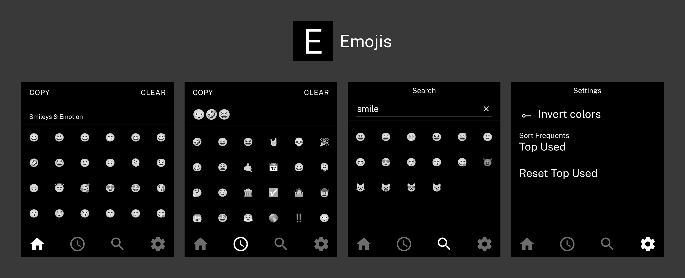

# Emojis

A simple emoji picker for the Light Phone III.

Browse all Android 14 emoji organized by category. Tap to add emoji to your selection, tap COPY to copy them to your clipboard, and CLEAR to start over.


---

## Features

- Full Android 14 emoji set organized by category
- Tap any emoji to add it to your selection
- COPY copies your selection to the clipboard
- CLEAR resets your selection
- Search any emoji by name or keyword
- Frequently-used emoji tab – for quick access to commonly used emoji
- Can be customized to show most recent or most used
- Respects LightOS theme (black/white mode)

---

## Installing on Light Phone III

- Highly recommend using [Obtainium](https://github.com/ImranR98/Obtainium) to ensure you receive future updates and new features automatically. Just add [the repo URL](https://github.com/zacksimpson/emoji-tool/), make sure you're able to install apps from unknown sources, and you're all set.
- Alternatively, you can download the latest APK from the Releases tab.


---

## Building

This project uses [Expo](https://expo.dev) and [EAS Build](https://docs.expo.dev/build/introduction/).

### Prerequisites

- [Bun](https://bun.sh)
- [EAS CLI](https://docs.expo.dev/build/setup/)
- An Expo account

### Steps

```bash
bun install
eas login
eas build --platform android --profile preview
```

EAS will build the APK in the cloud and provide a download link.

---

## Credits

- [vandamd](https://github.com/vandamd) – [light-template](https://github.com/vandamd/light-template), the community Expo template this app is built on
- [Unicode Full Emoji List, v13.1](https://unicode.org/emoji/charts-13.1/full-emoji-list.html) – for full official index of emojis, names, and keywords
- [The Light Phone](https://www.thelightphone.com) – for building a phone worth making apps for
